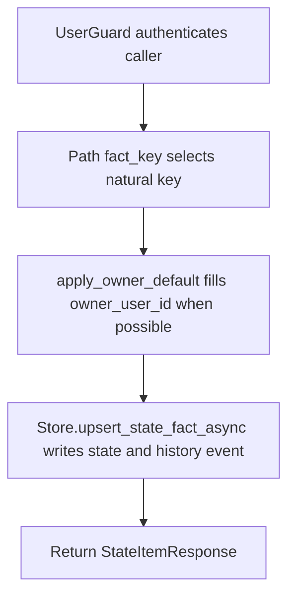

# PUT /v1/state/profile/facts/{fact_key}

## Summary
Create or merge a profile/state fact by natural key.

## Handler
- Rust handler: `upsert_state_fact`
- Route registration: `src/routes.rs::build_router`
- Authentication: UserGuard; owner default may apply

## Path Parameters
| Name | Type | Description |
| --- | --- | --- |
| fact_key | string | Natural key for a profile/state fact. |

## Query Parameters
None.

## JSON Body Parameters
Schema: `UpsertStateFactRequest`

| Field | Type | Requirement | Description |
| --- | --- | --- | --- |
| owner_user_id | string | optional, auth default may apply | Owner for the state fact. |
| state_type | string | optional | State category such as profile, preference, or memory. |
| title | string | optional | Display title for the fact. |
| statement | string | optional | Canonical natural-language statement. |
| value | JSON value | optional, default null | Structured value for the fact. |
| confidence | number | optional, default 0.7 | Confidence score. |
| salience | number | optional, default 0.5 | Salience score. |
| valid_from | RFC3339 datetime | optional | Start of validity interval. |
| valid_to | RFC3339 datetime | optional | End of validity interval. |
| source_refs | SourceRef[] | optional, default [] | Evidence references. |
| merge_policy | string | optional, default merge | How to merge with existing facts with the same key. |
| idempotency_key | string | optional | Client deduplication key. |

## Response
Schema: `StateItemResponse`

| Field | Type | Description |
| --- | --- | --- |
| item | StateItem | Current state fact. |
| history_event_id | string | History event emitted for the mutation. |
| context_uri | string | Context URI for the fact. |
| decision | string | Store merge/upsert decision. |

## Errors and Access Rules
- Malformed JSON or missing required runtime fields returns 400.
- Owner-scoped endpoints return 403 when the authenticated principal cannot access the requested owner.
- Store, Meilisearch, or LLM failures are returned through the shared ApiError JSON envelope.

## Internal Logic Call Graph

