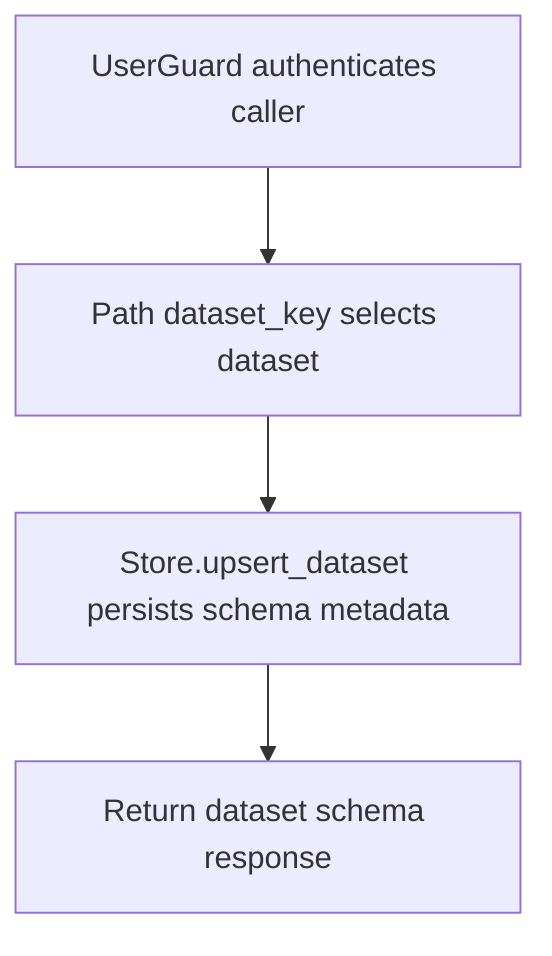

# PUT /v1/state/structured/datasets/{dataset_key}

## Summary
Create or update structured dataset schema metadata.

## Handler
- Rust handler: `upsert_dataset`
- Route registration: `src/routes.rs::build_router`
- Authentication: UserGuard

## Path Parameters
| Name | Type | Description |
| --- | --- | --- |
| dataset_key | string | Dataset key. |

## Query Parameters
None.

## JSON Body Parameters
Schema: `DatasetSchemaUpsertRequest`

| Field | Type | Requirement | Description |
| --- | --- | --- | --- |
| title | string | optional | Dataset display title. |
| description | string | optional | Dataset description. |
| granularity | string | optional | Expected period granularity. |
| subject_type | string | optional | Entity type represented by dataset rows. |
| columns | DatasetColumn[] | optional, default [] | Column definitions: name, kind, required, semantic_role, trend_direction. |
| idempotency_key | string | optional | Client deduplication key. |

## Response
Schema: `DatasetSchemaResponse`

| Field | Type | Description |
| --- | --- | --- |
| dataset | DatasetRecord | Dataset metadata and schema. |
| history_event_id | string? | History event id when emitted. |

## Errors and Access Rules
- Malformed JSON or missing required runtime fields returns 400.
- Owner-scoped endpoints return 403 when the authenticated principal cannot access the requested owner.
- Store, Meilisearch, or LLM failures are returned through the shared ApiError JSON envelope.

## Internal Logic Call Graph

